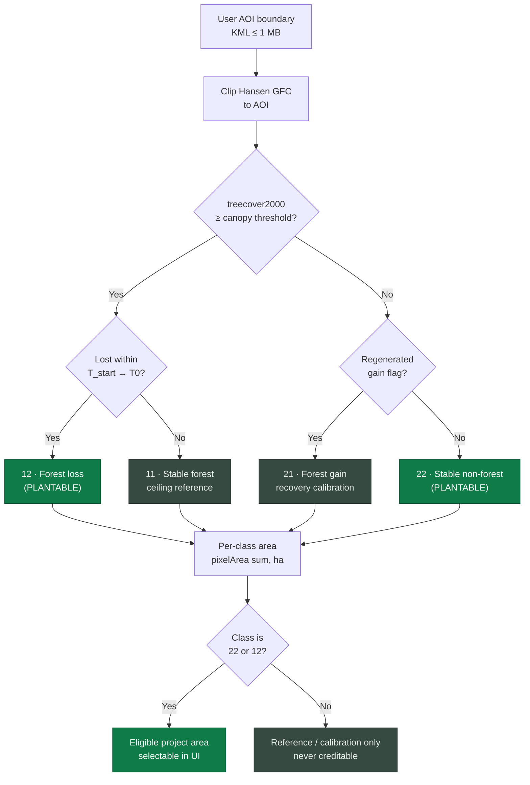
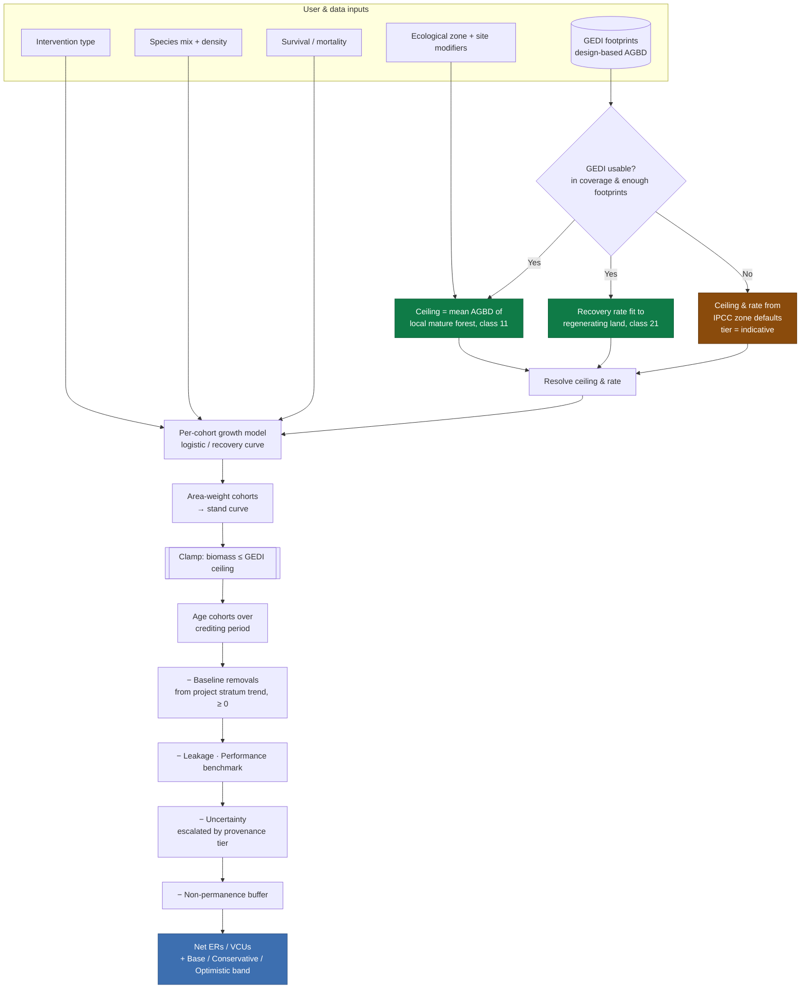

# Insights Module — Technical Documentation

**ARR Due Diligence · OBIWAN** — Ex-ante screening for Afforestation, Reforestation and Revegetation (ARR) carbon projects.

Powered by Hansen Global Forest Change, NASA GEDI biomass, and a VM0047-aligned quantification engine.

---

> ## ⚠️ Notice to all users
>
> **This tool is a preliminary screening instrument.** It is designed to be run *before* a
> complete pre-feasibility analysis, not in place of one. Its outputs identify and rank
> candidate areas and give order-of-magnitude carbon and credit estimates so that scarce
> field and modelling budgets can be pointed at the right sites. It is **not** a validated
> quantification, a Project Design Document (PDD), or a substitute for site-level
> measurement or assessment by a validation and verification body (VVB). Every figure it
> produces carries a provenance label indicating how much local measurement stands behind
> it; read that label before quoting any number.

---

## Contents

1. [Theoretical Foundation & Geospatial Data Integration](#section-1--theoretical-foundation--geospatial-data-integration)
2. [Reforestation Interventions & User Parameters](#section-2--reforestation-interventions--user-parameters)
3. [Decision Logic & Data Flow](#section-3--decision-logic--data-flow)
4. [Use Cases & System Limitations](#section-4--use-cases--system-limitations)
5. [QA / FAQ](#section-5--qa--faq)

---

## Section 1 — Theoretical Foundation & Geospatial Data Integration

The module's central design principle is that **statistics are disciplined by geography**.
Rather than projecting an idealised growth curve in isolation, every quantitative estimate
is bounded by what two authoritative Earth-observation datasets actually record about the
project's own landscape. Two datasets do the constraining: **Hansen Global Forest Change**
constrains *where* an intervention is eligible, and **NASA GEDI** constrains *how much*
carbon that intervention can plausibly accumulate.

### 1.1 Hansen Global Forest Change integration — isolating eligible land

The tool uses the Hansen Global Forest Change (GFC) product (default source
`UMD/hansen/global_forest_change_2025_v1_13`, 30 m resolution) as its **single, global
forest-change source**. Restricting to one product is deliberate: it makes the
classification reproducible and directly comparable from one country to the next, with no
dependence on national land-cover layers that vary in quality and availability.

For a user-defined analysis window (`T_start → T0`), each 30 m pixel is assigned to one of
four transition classes by a strict decision tree evaluated server-side in Google Earth
Engine:

| Code | Class | Definition | Role in the screen |
|------|-------|------------|--------------------|
| **11** | Stable forest | Forest in 2000, still forest at T0 | Ceiling reference (Section 1.2) |
| **22** | Stable non-forest | Non-forest throughout the window | **Plantable** |
| **12** | Forest loss | Forest at T_start, cleared within the window | **Plantable** |
| **21** | Forest gain | Non-forest that regenerated to forest | Regeneration calibration only |

"Forest" is defined by a user-set **canopy-cover threshold** on the year-2000 baseline
(`treecover2000`, default 25%). Loss is dated by the `lossyear` band and restricted to the
analysis window; a pixel is "forest at T_start" only if it was forest in 2000 and had not
already been lost by T_start.

**Isolation of the two plantable classes.** ARR activities can only be credited on land
that is genuinely non-forest at the project start. The module therefore treats **only
classes 22 (Stable non-forest) and 12 (Forest loss)** as candidate project area:

- **Stable non-forest (22)** — land that has carried little or no tree cover throughout the
  window. This is the classic ARR opportunity: degraded pasture, abandoned cropland, open
  scrub available for planting or assisted regeneration.
- **Forest loss (12)** — land deforested within the window and not yet recovered. It is a
  restoration opportunity, though the cause of loss (which Hansen does not distinguish, see
  Section 4) should be understood before committing.

Classes **11 (Stable forest)** and **21 (Forest gain)** are *never* offered as project area
in the interface. Stable forest is not ARR-eligible; it serves only as the carbon ceiling
reference. Forest gain is used only to calibrate the recovery rate of the growth curve.

> **Hansen caveat (honest disclosure).** Hansen's `gain` band covers 2000–2012 only and
> carries no year, so class 21 cannot be restricted to an arbitrary analysis window. The
> module uses it *exclusively* to calibrate a regeneration rate, never as creditable area.
> Separately, Hansen "loss" means stand-replacing canopy removal, which includes plantation
> harvest and natural disturbance — it is a canopy-change signal, not a deforestation
> figure.

### 1.2 GEDI biomass integration — the localised carbon ceiling

Where Hansen answers *where*, NASA's **GEDI** (Global Ecosystem Dynamics Investigation)
answers *how much*. GEDI is a spaceborne LiDAR instrument that samples canopy structure and
returns **Above-Ground Biomass Density (AGBD)** at the footprint level (Level 4A product,
~25 m footprints). Critically, GEDI is a **statistical sample of the landscape, not a
wall-to-wall map** — and the module treats it as such.

#### Design-based estimation, not pixel arithmetic

Differencing two interpolated biomass maps confounds model error with real change and
yields no defensible uncertainty. Instead, the module treats the GEDI footprints falling
inside each transition class as a sample and computes a **design-based estimate** — a mean
AGBD with a **hybrid standard error** that combines the sampling variance of the mean with
GEDI's own per-footprint model variance:

```
ȳ      = mean(yᵢ)                 estimated mean AGBD for the stratum (Mg/ha)
v_samp = s² / n                   design-based sampling variance of the mean
v_pred = mean(uᵢ²) / n            GEDI model prediction-error contribution
SE     = √(v_samp + v_pred)       hybrid standard error
95% CI = ȳ ± 1.96 · SE
```

Every downstream figure inherits this uncertainty, which is why the interface shows a
confidence interval on essentially every biomass quantity.

#### The carbon ceiling ("carbon equilibrium")

The key ecological construct is the **carbon ceiling**: the maximum above-ground biomass the
project land can realistically sustain, estimated from the **mean AGBD of the surrounding
mature forest** (the Stable-forest stratum, class 11) *in the same landscape*. This is the
localised carrying capacity — the biomass level toward which an undisturbed stand in this
climate, on these soils, at this elevation, tends to equilibrate.

The module additionally fits the **recovery rate** of the accumulation curve to the measured
multi-year trend of locally regenerating land (the Forest-gain stratum, class 21), so both
the *asymptote* and the *speed of approach* reflect this specific place rather than a
textbook.

#### Why the curve must be constrained by GEDI — the ecological theory

A carbon accumulation curve is, ecologically, an approach to a **stable equilibrium**, not
an unbounded exponential. As a stand ages, growth slows: light, water, and nutrients become
limiting, self-thinning sets in, and net biomass gain asymptotes toward the carrying
capacity of the site. **No reforestation intervention can push a stand's biomass durably
above the level that the surrounding mature vegetation already demonstrates is
sustainable**, because the same climatic and edaphic limits apply.

The module enforces this directly: the resolved growth curve is **clamped so that projected
biomass never exceeds the GEDI-derived ceiling of the local landscape.** This has three
practical consequences:

1. **Conservatism by construction.** Optimistic species-level yields are capped at what the
   landscape can actually hold, which is the risk-appropriate posture for a screening tool.
2. **Local realism over global averages.** A dry-forest project is held to a dry-forest
   ceiling; a humid-tropical project to a humid-tropical ceiling — measured on site, not
   assumed.
3. **Transparent provenance.** When GEDI cannot supply the ceiling (see below), the tool
   falls back to a published ecological-zone default and *labels the result as indicative*.

#### Provenance tiers

Because GEDI does not exist everywhere or always in sufficient density, every curve carries
a **provenance tier** that follows the numbers all the way to the exported report:

| Tier | Meaning |
|------|---------|
| `gedi_calibrated` | Both ceiling and recovery rate fit to this AOI's own GEDI record. Strongest evidence. |
| `gedi_partial` | One of the two comes from GEDI, the other from published defaults. |
| `ipcc_default` | No usable GEDI (outside the ±51.6° orbital band, or too few footprints). Curve is literature-based — **indicative only**. |

The uncertainty deduction applied downstream (Section 3) escalates automatically as the tier
weakens (10% → 20% → 30%), because claiming a 10% uncertainty on a curve with no site
measurement would not be defensible.

---

## Section 2 — Reforestation Interventions & User Parameters

### 2.1 Where the defaults come from, and how to override them

The module ships two internal reference databases that seed every parameter:

- **An ecological-zone table** (10 FAO global ecological zones) providing, per zone, an AGB
  ceiling, early- and mature-phase growth rates, a root-to-shoot ratio, and a recovery-rate
  constant. The zone is auto-suggested from the AOI's latitude and mean tree cover, and can
  be overridden.
- **A species-template library** (native mixed broadleaf, fast-growing pioneer, eucalyptus,
  teak/long-rotation hardwood, agroforestry/fruit, mangrove, natural-regeneration cohort),
  each carrying allometric and growth parameters.

> **These are screening approximations informed by IPCC 2019 Refinement (Vol. 4, Ch. 4),
> not verified Tier-2 values.** They exist to give a sensible curve before the user supplies
> better numbers.

**User-supplied data.** Every field is exposed in the interface. A user with
species-specific or measured parameters can:

1. Select a template as a starting point, then edit any field (max AGB, growth-rate
   constant, stem density, mortality, wood density, root:shoot, harvest cycle).
2. Build a **multi-cohort mix** (up to five species), each with its own parameters and an
   area fraction; fractions are normalised to sum to 1.
3. Enable **GEDI calibration**, which overrides the template ceiling (and, where possible,
   the recovery rate) with values measured on the AOI itself.

Where local GEDI calibration and user parameters disagree, the resolved ceiling is taken
from the strongest available evidence and each species' own maximum AGB is scaled to that
ceiling, so a locally-measured carrying capacity is never silently ignored.

### 2.2 Parameter reference

For each parameter: **what it is**, **why it matters**, and **how it operates in the data
flow** (its effect on the curve's shape or asymptote).

---

#### Intervention Type

**What it is.** The land-management strategy. The module implements three intervention
archetypes, each mapped to a growth-model family and a set of establishment assumptions:

| Value | Growth model | Establishment | Notes |
|-------|--------------|---------------|-------|
| **Active planting** | Logistic | Bare ground, ~1 yr lag, defined stem density | Fastest early accrual, highest establishment cost and mortality risk |
| **Assisted Natural Regeneration (ANR)** | Recovery curve | Existing rootstock/seed bank, head-start ("advancement years"), no planting | Slower canopy closure but non-zero year-0 stock |
| **Mixed / enrichment** | Blend | ANR matrix with enrichment planting in gaps | Weighted by an ANR area fraction |

*Agroforestry* is supported, but as a **species/composition choice** (the agroforestry
template: low stem density, low ceiling, livelihood co-benefits) rather than a fourth
intervention toggle. Model it by selecting active planting (or mixed) with the agroforestry
cohort at an appropriate density.

**Why it matters.** The intervention determines the *fundamental shape* of the curve.
Active planting starts from zero and follows a sigmoid establishment curve. ANR starts from
standing biomass and follows a saturating recovery toward the ceiling — crediting only the
year-over-year *increment*, never the pre-existing stock (an early modelling error that this
tool explicitly corrects). This distinction is material to both the timing and the
additionality of credits.

**How it operates in the data flow.** The intervention preset supplies (a) the growth-model
family, (b) an establishment lag that shifts the curve right, (c) an advancement-years
head-start for ANR, and (d) multiplicative modifiers on both the growth rate and the
ceiling. It is the first lever applied when the curve is resolved.

---

#### Species Composition

**What it is.** The mix of species cohorts on the project area — from a **monoculture**
(a single cohort at 100% area fraction) to a **mixed native** planting (several cohorts,
each with an area share). Each cohort carries its own growth model, maximum AGB, growth-rate
constant, stem density, mortality, and wood density.

**Why it matters.** Composition affects two things the carbon accounting cares about:

- **Early-stage growth rate.** Fast-growing pioneers close canopy and accrue biomass
  quickly but plateau at a lower ceiling; long-rotation hardwoods start slowly but reach a
  higher, more stable carbon density.
- **Long-term carbon-density stability.** Mixed native stands are generally more resilient
  (pest, disease, drought, fire) and hold a more stable long-term carbon density than a
  monoculture, which is exposed to correlated failure and, if harvested, to periodic
  stock resets.

**How it operates in the data flow.** Each cohort's carbon curve is computed independently
and then **area-weighted** by its fraction to produce the stand-level curve. A cohort's own
maximum AGB is treated as its share of the site's potential and rescaled to the resolved
(GEDI-constrained) ceiling, keeping the mix internally consistent with the measured carrying
capacity.

---

#### Initial Planting Density (trees/ha)

**What it is.** The number of stems established per hectare (typical range ~400–2,500
trees/ha; 0 for pure natural-regeneration cohorts). Agroforestry sits low (~400); native
restoration around 1,100; dense pioneer or mangrove plantings higher.

**Why it matters.** Density governs the **slope of the early-stage accumulation curve** —
how quickly the site captures growing space and closes canopy — and interacts with mortality
to determine effective stocking. Too low and the site under-utilises its growing space for
years; too high and self-thinning and competition erode the benefit.

**How it operates in the data flow.** Density scales the establishment phase of planted
(logistic) cohorts and is the base against which the survival/mortality discount is applied.
Because the stand-level ceiling is fixed by the site's carrying capacity, density chiefly
affects *how fast* the curve climbs, not its asymptote — a denser planting reaches a given
carbon level sooner but converges to the same ecological ceiling.

---

#### Expected Survival Rate (%)

**What it is.** The proportion of established stems that persist. In the module this is
expressed through two mortality parameters rather than a single number: a **first-year
(establishment) mortality** and an **annual mortality** thereafter. Effective survival is
`(1 − establishment mortality) × (1 − annual mortality)^years`, applied up to canopy closure.

**Why it matters.** Survival acts as a **discount factor on the early biomass-accumulation
slope.** Establishment losses are the leading cause of ARR under-performance; a curve that
assumes perfect survival systematically over-credits the first decade. Disturbance settings
(fire risk, grazing pressure) feed directly into mortality, because browsing and fire are
the dominant real-world causes of seedling loss.

**How it operates in the data flow.** Survival reduces effective stocking during the
establishment phase, damping the early slope. It is applied **only up to canopy closure**,
by design: a stand's maximum AGB is a *stand-level* asymptote that already embeds
self-thinning, so compounding per-stem mortality across the full rotation would double-count
losses and drive the curve unphysically downward in later decades. Mortality therefore
discounts early accrual, not the mature ceiling.

---

### 2.3 Modifiers: site, climate, and disturbance

On top of intervention, composition, density and survival, four site-condition levers apply
**multiplicative modifiers** to the growth rate and the ceiling (and additive modifiers to
mortality):

- **Site index** (0.5–1.5) — productivity relative to the zone average.
- **Soil quality** (degraded / moderate / good).
- **Water stress** (none / seasonal / severe).
- **Fire risk** and **grazing pressure** (none/low → high) — primarily raise mortality.

These compound (a degraded, drought-stressed site is worse than either alone) and are
clamped to sane bounds so that a stack of pessimistic settings cannot drive the curve to
zero. All of this remains subordinate to the GEDI ceiling: modifiers move the curve *within*
the envelope the landscape allows, never above it.

---

## Section 3 — Decision Logic & Data Flow

### 3.1 The spatial screening logic

Before any carbon is modelled, the tool decides **which land is eligible**. The AOI (a KML
boundary, ≤ 1 MB) is intersected with the Hansen product, classified into the four
transition classes, and filtered so that only the two plantable classes can become project
area. Per-class areas are computed with a latitude-corrected pixel-area sum (never a naive
pixel count), so hectare figures are correct at any latitude.



### 3.2 The carbon curve calculation engine

Once eligible area is known, the engine resolves a single stand-level carbon curve from five
independent levers, constrains it to the GEDI ceiling, ages the project cohorts over the
crediting period, and applies the VM0047-aligned deduction chain to reach a net emission-
reduction (ER) estimate with a sensitivity band.



**Reading the engine.** The two branches out of "GEDI usable?" are the provenance fork: the
green path (site-calibrated) and the amber path (IPCC-default, indicative). The
double-bordered **clamp** node is where the ecological-ceiling constraint from Section 1.2 is
enforced. The deduction chain at the bottom is where screening-level additionality and
permanence are represented conservatively (Section 4 and FAQ Q4).

---

## Section 4 — Use Cases & System Limitations

### 4.1 Primary use case

**A rapid, first-pass screening and pre-feasibility evaluation tool.** Its job is to help a
project developer, investor, or analyst answer, in minutes and at zero field cost:

- *Is there enough eligible (Stable non-forest / Forest loss) land in this AOI to be worth
  pursuing?*
- *What is the order-of-magnitude carbon and credit potential, with an honest uncertainty
  band?*
- *How do intervention choices (planting vs. ANR, species, density) change that potential?*
- *Which of several candidate areas should receive the limited budget for full field
  measurement and methodology-compliant modelling?*

It is a **funnel and a triage instrument** — a way to spend expensive due-diligence effort
only where the cheap screen says it is warranted. It sits *before* a full pre-feasibility or
site-level feasibility study, not in place of it.

### 4.2 Key limitations

**Reliance on global default datasets.** Hansen and GEDI are global products with genuine,
well-documented localisation discrepancies:

- Hansen may mis-time or mis-classify change in cloud-prone, dry, or plantation landscapes,
  and its "loss" does not distinguish deforestation from harvest or natural disturbance.
- GEDI is a *sample*, is unavailable above ~51.6° latitude, and can be sparse over small
  AOIs — in which cases the tool falls back to zone defaults and labels results as
  indicative.
- Both are subject to their own measurement and model error, which the tool propagates but
  cannot eliminate.

**Simplified, screening-level carbon model.** The engine is a transparent, screening-grade
model — *not* a full Tier 3, methodology-specific accounting. Specifically:

- The baseline is approximated (from the project stratum's own historical trend, clamped to
  be non-additional), not a formally modelled Verra/Gold Standard counterfactual.
- Additionality, leakage, and non-permanence are represented as **conservative deductions**,
  not as the evidence-based assessments a methodology requires (see FAQ Q4).
- Carbon pools are simplified (above- and below-ground woody biomass by default; SOC,
  deadwood, and litter optional and unverified).
- The GEDI standard error slightly understates total uncertainty because it approximates,
  rather than fully propagates, GEDI's model covariance term. This is one reason the tool
  applies its own sample-size-aware uncertainty floor.

**In short:** the outputs are defensible as a *screen* and indefensible as a *submission*.
Treat the sensitivity range, not the point estimate, as the result, and never use these
figures for credit issuance, sales, or investment commitment without the subsequent
feasibility work they are meant to prioritise.

---

## Section 5 — QA / FAQ

**Q1 — Is there another version of this tool available?**

Yes. This release is an early, evolving version, deliberately not framed as a finished
product. It emerged from an iterative development process and is expected to grow — more
datasets, richer intervention modelling, and tighter methodology alignment are on the
roadmap. We see tooling in this space as a collaboration: user feedback from real screening
work directly shapes what gets built next. If you have parameters, local data, or workflow
needs the tool does not yet cover, that input is welcome and actively wanted.

---

**Q2 — Why do the carbon estimations from this tool look different from my own field
data or models?**

This tool uses a **carbon-equilibrium approach.** Its projected carbon stock will *never*
exceed the ecological carrying capacity defined by the local GEDI biomass data (the mean
biomass of the surrounding mature forest). Your ground-measured results or local models may
show higher potential yields under optimal management — and they may well be right for a
specific, well-tended stand. This tool deliberately implements a **conservative,
ecologically constrained ceiling for risk management**: at the screening stage it is safer
to under-promise. Remember that this tool precedes a full pre-feasibility or comprehensive
site-level feasibility study, where localised parameters and primary field data are fully
integrated and where a higher, well-substantiated yield can legitimately be modelled.

---

**Q3 — What is the spatial resolution and update frequency of the underlying data?**

- **Hansen Global Forest Change** — 30 m pixels, updated annually. The default source is the
  2025 v1.13 collection, whose loss record extends through 2024; older collections remain
  selectable for reproducibility.
- **GEDI L4A biomass** — ~25 m footprints, collected from 2019 onward as an orbital *sample*
  (not wall-to-wall), between roughly 51.6° N and 51.6° S. The tool aggregates the available
  multi-year footprint record per transition class.

Because these cadences differ and GEDI is a sample, small or recently-changed AOIs can have
thin footprint counts. The provenance tier on every output tells you when this has forced a
fallback to defaults. Re-running after a new Hansen release, or over a larger AOI, can
improve both the classification currency and the GEDI sample size.

---

**Q4 — How are additionality and leakage handled at this screening stage?**

Conservatively and approximately — **not** as a methodology-compliant assessment. At the
screening stage:

- **Additionality** is approached two ways. Observed historical additionality (whether the
  land is already gaining biomass) is reported as a sanity check. For the ex-ante estimate,
  the baseline is taken from the project stratum's *own* historical trend and clamped to be
  non-additional (≥ 0), so any pre-existing biomass gain is subtracted from the project's
  gross removals every year rather than credited. This is a deliberately cautious proxy for
  a formally modelled counterfactual, not a substitute for one.
- **Leakage** is applied as a user-set percentage deduction over a configurable period, a
  placeholder for the activity-shifting and market-leakage analysis a full methodology
  requires.
- **Non-permanence** is represented by a buffer-pool deduction, and **uncertainty** by a
  deduction that escalates automatically when the carbon curve is not backed by local GEDI
  measurement.

A rigorous additionality demonstration (regulatory surplus, barrier analysis, common-
practice) and a quantified leakage assessment are part of the *feasibility* stage that this
screen is designed to precede, not replace.

---

**Q5 — Can I use these outputs for credit issuance, sales, or an investment decision?**

No. These are ex-ante *screening* figures. They are appropriate for prioritising sites,
sizing an opportunity, and deciding where to spend field budget. They are not a validated
quantification and must not be used for issuance, forward sales, or a final investment
commitment without the subsequent methodology-compliant feasibility work.

---

**Q6 — My project area is outside GEDI coverage (high latitude). Does the tool still work?**

Yes, with a clearly-labelled caveat. Outside the ±51.6° GEDI band, the carbon curve cannot
be calibrated from local LiDAR and falls back to IPCC ecological-zone defaults; results are
tagged `ipcc_default` (indicative only) and carry a larger uncertainty deduction. The
spatial screen (Hansen classification, eligible-area accounting) works everywhere on Earth
regardless of GEDI coverage.

---

**Q7 — What does the "provenance tier" on my results mean, and why should I care?**

It states how much local measurement stands behind the carbon numbers:
`gedi_calibrated` (site-measured ceiling and rate), `gedi_partial` (one of the two), or
`ipcc_default` (literature only). It is the single most important label on any output: a
`gedi_calibrated` estimate is a defensible screen, while an `ipcc_default` estimate is an
order-of-magnitude indication. Always quote the tier alongside the number.

---

### Document control

| Field | Value |
|-------|-------|
| Module | `/insights` — ARR Due Diligence · OBIWAN |
| Status | Screening tool (pre-feasibility). Not for issuance or investment commitment. |
| Data sources | Hansen GFC (UMD) · GEDI L4A (NASA/UMD) |
| Methodology alignment | VM0047-aligned, screening-level (not a validated quantification) |
| Default parameter provenance | IPCC 2019 Refinement, Vol. 4, Ch. 4 — verify before any submission |
